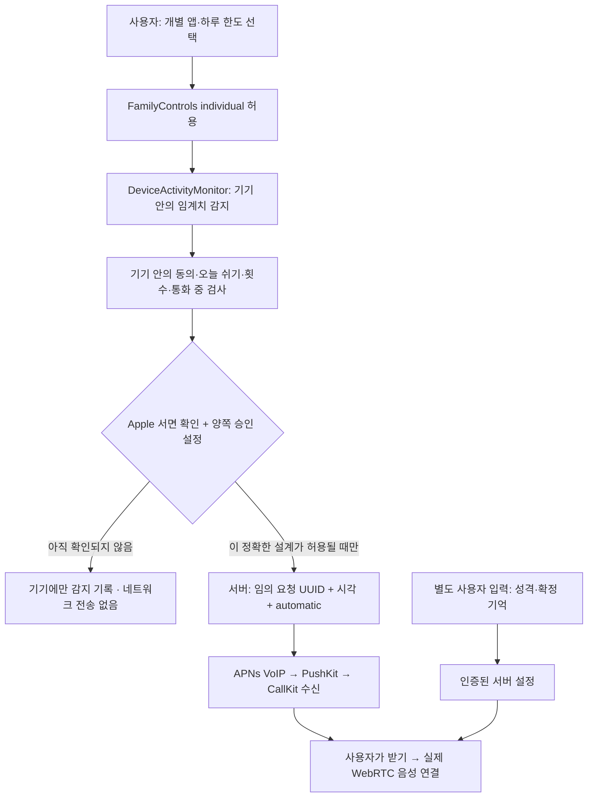

# Apple 확인 요청 준비 문안 — 발송 전 초안

작성일: 2026-09-29. **Apple에 발송하지 않았으며, 답변·승인·배포 권한을 받았다는 증거도 없습니다.** 아래 문안과 데이터 흐름은 실제 구현한 원형을 기준으로 합니다.

## 개발자 지원 문의 문안

Subject: Family Controls / DeviceActivity — permission to send a minimal usage-derived VoIP request signal for an individual focus app

We are prototyping an iPhone app for adult users to manage their own app use and begin an intended task. The user chooses individual applications with FamilyActivityPicker, grants individual FamilyControls authorization, sets a separate daily usage budget for each chosen application, and explicitly asks an AI voice companion to call when a budget is reached. During the call the companion helps the user take one small action and can remain in an actual two-way voice conversation for 20 minutes.

Application tokens, application identity, usage budgets, daily threshold history and call-attempt limits remain on the device. We do not export a DeviceActivityReport, access raw usage data, or try to distinguish short videos from other activity inside an application.

Our proposed DeviceActivityMonitor extension would, after reaching a local threshold and applying on-device consent/pause/call-limit rules, send ONLY a randomly generated call-request UUID, the request timestamp, and a generic automatic-call mode to our authenticated backend. It would not send the application token/name/category/domain, usage duration, chosen budget or threshold count. The backend would send an APNs VoIP push for an actual AI voice call. The app would immediately report the incoming call to CallKit and connect an actual WebRTC audio session when answered. Delayed requests would expire. We would not use VoIP pushes for reminders, analytics, or silent background processing.

Separately, the user explicitly provides character preferences and confirms conversational memories. Those user-provided settings may be synchronized to the backend and supplied to the voice service. They do not include Screen Time reports or usage-derived app context.

Under section 3.3.3(P) of the Apple Developer Program License Agreement, is the proposed minimal request signal itself considered prohibited external sharing of device/usage data for individual authorization? Can this specific architecture be used for an individual focus/productivity app? If it cannot, is there an approved alternative that preserves individual authorization and an actual incoming voice call without exporting usage-derived signals?

We will not enable automatic external signaling until we receive clarification. At present the extension records thresholds locally only; manual user-initiated voice-call tests are separate. Please also clarify whether this AI-to-individual two-way audio call is an eligible VoIP/CallKit use, and which app/extension entitlement and review information is required for TestFlight distribution.

## 전달용 데이터 흐름

## 실제 구현과 문의의 연결

| 항목 | 구현 |
|---|---|
| 사용 한도·선택 토큰·시도 기록 | App Group의 기기 안 저장소 |
| 승인 전 임계치 이벤트 | `local_only_apple_approval_pending`로 기기에 기록. 전송 작업도 생성하지 않음 |
| 제안된 최소 신호 | `requestId`, `createdAt`, `mode=automatic` |
| 서버로 보내지 않는 정보 | 앱 토큰·이름·카테고리·도메인·사용 시간·한도·횟수·보고서 |
| 실제 수신과 음성 | PushKit/CallKit + 네이티브 WebRTC/OpenAI Realtime |
| 만료 | 이벤트 60초 이후 요청 거부, 수신 요청 30초 유효 |
| 재전화 | 최초 거절/부재중 후 기기에서 새 추가 사용 이벤트 등록. 같은 앱 하루 최대 2회 |
| 중단 | 기기와 서버의 먼저 전화 끄기/오늘 쉬기. 통화 중 추가 임계치는 버림 |
| 배포 권한 | 앱과 DeviceActivityMonitor 확장 기능 각각 Family Controls 배포 권한 필요 |

## 근거 문서와 미확정 사항

- [Apple 개발자 프로그램 약관](https://developer.apple.com/support/terms/apple-developer-program-license-agreement/): 3.3.3(P)의 개별 사용자·기기 범위와 공유 제한을 확인해야 합니다. 사용자 동의만으로 외부 전송 허용을 추정하지 않습니다.
- [DeviceActivityEvent](https://developer.apple.com/documentation/deviceactivity/deviceactivityevent): 선택 대상의 임계치 감지를 문서상 지원하지만, 서버 전송 허용을 보장하는 설명은 아닙니다.
- [includesPastActivity](https://developer.apple.com/documentation/deviceactivity/deviceactivityevent/init(applications:categories:webdomains:threshold:includespastactivity:)): 처음 감지는 당일 기존 사용 포함, 재전화는 등록 전 사용 제외로 구현합니다. 앱과 연결된 웹 도메인의 암묵적 집계도 설명되어 있습니다.
- [PushKit의 VoIP 수신](https://developer.apple.com/documentation/pushkit/responding-to-voip-notifications-from-pushkit): 실제 VoIP 요청을 즉시 CallKit에 보고해야 합니다. 이 원형의 개별 제품 용도가 심사에서 허용됐다는 의미는 아닙니다.
- [Family Controls 배포 권한 요청](https://developer.apple.com/documentation/familycontrols/requesting-the-family-controls-entitlement): 앱과 확장 기능별로 요청해야 합니다.

답변이 오면 문의 번호, 답변 전문, 검토한 정확한 앱·서버 버전, 허용 범위를 함께 보관해야 합니다. 허용 범위가 다르면 승인 설정만 켜지 말고 데이터 흐름을 먼저 수정합니다.
