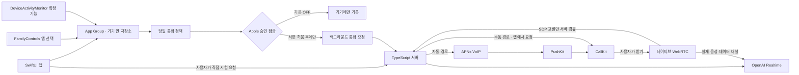

# 구현 구조와 통화 규칙

## 각 부분이 맡는 일

하루 한도나 토큰을 서버가 받아 판단하는 구조가 아닙니다. 기기의 정책이 먼저 판단합니다. 캐릭터·확정 기억은 사용자의 별도 설정으로 서버에 동기화하고, 통화 요청 시 그 순간의 설정을 복사하여 고정합니다. 통화 중 설정을 바꾸더라도 진행 중인 통화에는 영향을 주지 않습니다.

## 첫 전화와 재전화

`jimin.daily`는 현지 자정부터 23:59:59까지 반복됩니다. **앱마다 별도의 event**를 만들고 각 event에 정확히 한 application token을 넣습니다. 처음 한도와 한도 수정에는 `includesPastActivity=true`를 사용하여 당일 이미 사용한 시간이 포함되도록 합니다. 사용 시간의 숫자를 추출하거나 Report 확장 기능을 밖으로 내보내지 않습니다.

처음 감지되면 정책은 `firstObserved`를 기록합니다. 권한 철회, 오늘 쉬기, 먼저 전화 끄기, 다른 통화 진행, 승인 잠금, 중복 감지에서는 전화를 만들지 않습니다. 통화 중에 버린 감지는 다시 쌓아두지 않습니다. 호출을 허용할 때만 임의 UUID를 예약하고 앱별 시도 횟수에 추가합니다. 모든 앱과 확장 기능의 변경은 **같은 파일 잠금** 아래 처리하여 거의 동시의 두 이벤트가 통화 두 개를 만들지 못하게 합니다.

첫 전화가 거절되거나 부재중으로 끝나면, 그 결과 직후 해당 앱만 들어가는 별도 `jimin.retry.<앱 UUID>` 일정을 **한 번** 등록합니다. `includesPastActivity=false`이므로 이 등록 이전에 쓴 시간은 재전화에 포함하지 않습니다. 기본 임계치는 추가 사용 20분입니다. 20분 뒤 타이머를 걸거나 `하루 한도+20분`으로 대충 추정하지 않습니다. 실기기에서는 결과 시각과 등록 시각 사이의 간격도 기록해야 합니다.

재전화 일정은 그날만 반복 없이 감지합니다. 한도 수정 시에는 이 일정을 다시 시작하지 않아 추가 사용 계산을 초기화하지 않습니다. 재전화 추가 사용 설정을 바꾸면 이미 시작한 오늘의 기준은 유지되고 다음 등록부터 적용됩니다. 받았으면 그 앱의 당일 재전화는 억제합니다. 한 앱을 같은 날 제거했다 다시 골라도 기기 안의 알려진 토큰과 기존 UUID를 재사용해 시도 횟수를 보존합니다.

기기의 현지 날짜가 바뀔 때 당일 정책 장부만 새로 시작합니다. 진행 중인 통화나 과거 결과를 지워서 자정 직후 통화를 중복 생성하지 않습니다. ‘오늘은 쉬기’는 그 날짜에만 유효합니다.

## 수신·음성 상태는 구분

`requested → ringing → answered → voiceConnected → ended`를 구분합니다. `declined`, `unanswered`, `failed`도 따로 기록합니다. 사용자가 수신 버튼을 눌렀다는 사실과 WebRTC 연결은 같지 않습니다. WebRTC 연결 기록도 실제 양쪽 귀에 들리는지까지 증명하지 않으므로 검증표에 따로 둡니다.

VoIP push는 즉시 CallKit에 보고합니다. 오래되거나 현재 정책에서 금지된 push도 보고 의무를 생략하지 않고 즉시 종료합니다. 다른 통화 중 이벤트는 대기열에 넣지 않습니다. 요청은 기기·서버 양쪽에서 만료되며 같은 UUID는 재전송해도 새 APNs 요청을 만들지 않습니다.

자동 요청의 백그라운드 URLSession 전송은 지연될 수 있습니다. 서버는 생성 후 60초를 넘긴 요청을 거부하고, APNs와 수신 화면은 생성 후 30초로 만료합니다. 앱을 사용자가 강제 종료했을 때의 실제 수신 여부는 별도 실기기 시험 대상입니다. 이를 ‘항상 도착’으로 보장하지 않습니다.

## 음성과 20분 동행

서버는 표준 OpenAI API 키를 가진 상태에서 `POST /v1/live/sessions`에 `{session, transport:{type:"webrtc",sdp}}`를 보냅니다. 반환된 세션 ID는 서버에만 저장하고 SDP answer만 앱에 돌려줍니다. 앱에는 키를 보내지 않습니다. `gpt-live-1`은 선택한 목소리와 한국어 대화·말 끼어들기를 담당하며, `gpt-6-luna` Responses 위임 모델이 기억·동행·일시정지 도구를 선택합니다. 세션 녹음 저장은 `store:false`입니다.

앱은 WebRTC 데이터 채널의 `session.started`를 받은 뒤 첫 인사를 요청합니다. 도구 호출은 바깥 `response.event` 안의 `response.output_item.done`에서 읽고, 앱이 동의·권한을 확인한 후 `response.item.create`로 결과를 돌려줍니다. 필요한 결과를 모두 보낸 뒤 `response.create`로 작업 모델을 이어갑니다. 일반 대화는 음성 모델이 직접 이어가고, 상태 변경이 필요할 때만 위임합니다.

앱은 CallKit 오디오 활성화 후에 WebRTC 오디오 장치를 켭니다. 백그라운드 침묵을 위한 가짜 오디오 파일이나 알림용 VoIP를 사용하지 않습니다. 실제 두 방향 마이크/수신 오디오를 가진 통화입니다. 동행 동의 후 20분 종료 시각을 정하고, 기존 성격·확정 기억·동의 규칙을 유지한 채 `session.instructions.append`로 조용한 동행 지시를 추가합니다. 종료 인사 뒤 `session.close`를 보내고 `session.closed`의 최종 사용 초 수를 서버에 기록합니다. 확인이 오지 않으면 최종 사용량은 미확정입니다. 앱의 실질적 상한은 약 29분, 서버 상한은 30분입니다.

## 전화의 이야기 선택

사용 시간 이벤트는 연락 타이밍을 정하는 기기의 신호입니다. 음성 대화는 ‘앱을 끄기/약속 확인/작은 행동’으로 자동 유도하지 않습니다. 자동·수동·재전화 모두 새로운 전화 요청을 만들 때 서버가 24개의 창작 출발점에서 무작위로 소재를 고릅니다. 8개 종류는 상상, 선택 놀이, 미니 상황극, 짧은 이야기, 취향 발견, 엉뚱한 토론, 다정한 질문, 이름 짓기입니다. AI가 선택한 성격과 사용자 답에 따라 즉흥적으로 내용을 변형하며, 녹음된 대사를 재생하는 구조가 아닙니다.

기기 서버 레코드에 마지막 12개의 비개인적인 소재 ID를 저장해 반복을 피합니다. 바로 직전과 다른 종류를 고릅니다. 통화 생성 시 소재와 캐릭터·확정 기억을 고정하며, 중복 생성 요청이나 GET 조회에서 다시 추첨하지 않습니다. OpenAI 세션 생성에도 동일한 소재를 전달합니다. 앱의 첫 발화 요청은 서버 지시와 이 소재를 유지합니다. 새 통화를 만들 때만 다시 선택합니다. 기기 데이터 삭제 시 이 소재 이력도 함께 제거됩니다.

기본은 짧고 재미있는 대화이며, 같은 앱을 그만 보라고 요구하지 않습니다. 사용자가 하고 싶은 일이나 함께 있고 싶은 마음을 먼저 말할 때만 20분 동행을 제안하고 동의를 확인합니다. 재미와 호기심이 실제 앱 사용 중단에 도움이 되는지는 사용자 실험의 가설이며, 구현·검사 통과로 입증하지 않습니다.

## 기억 저장

후보는 `MemoryProposal`로 잠시 메모리에만 둡니다. 일반 저장소에는 `ConfirmedMemory`만 들어갑니다. GPT-Live의 문자 변환은 문장 완료 신호 없이 조각으로 오므로, 앱은 음성 조각의 시간 순서·질문 이후 발화·1.2초의 안정 구간·최근 30초 조건을 확인합니다. 자동 음성 저장은 명시적인 “기억해 줘/저장해 줘”만 허용하며, 짧은 “응”은 확인 버튼으로 마무리할 수 있습니다. 동행 질문과 기억 질문을 한 번에 묻거나 애매한 대답을 하면 저장하지 않습니다.

새 후보는 다음 통화의 기억에 포함하지 않습니다. 수정·삭제한 확정 목록은 서버에 순차적으로 반영하고, 다음 통화를 만들기 전에 동기화를 기다립니다. 종료된 서버 통화의 개별 기억 스냅샷은 제거합니다. 녹음 파일과 대화 전문은 이 앱/서버에 보관하지 않습니다.

## 서버 API

| 경로 | 역할 |
|---|---|
| `GET /health` | 비밀 없이 구성 상태 확인 |
| `POST /v1/devices` | 연결 코드로 등록, 임의 기기 토큰 발급 |
| `PUT /v1/device/profile` | 캐릭터·확정 기억·오늘 쉬기 동기화 |
| `PUT/DELETE /v1/device/push` | VoIP 토큰 등록·무효화 |
| `POST /v1/voice-preview` | 별도로 표시하는 TTS 말투 예시 |
| `POST /v1/calls` | 수동/승인된 자동 요청. 자동 요청 허용은 별도 서버 잠금 |
| `GET /v1/calls/:id` | 해당 기기의 전화 상태와 고정 설정 |
| `POST /v1/calls/:id/session` | 받기 확인 후 서버에서 음성 SDP 교환 |
| `POST /v1/calls/:id/result` | 수신·받기·음성·거절·부재중·실패·종료 |
| `POST /v1/calls/:id/usage` | `session.closed`에서 확인한 최종 Live 사용 초 수 |
| `POST /v1/calls/:id/feedback` | 앱 중단과 다음날 의향의 자기보고 |
| `DELETE /v1/device` | 해당 기기 서버 데이터 삭제·인증 폐기 |

다른 기기의 UUID를 알아도 접근할 수 없습니다. 토큰은 서버에서 해시로만 저장하고, 입력 필드를 허용 목록으로 제한하여 사용 시간·앱 토큰 등이 우연히 추가되어도 거부합니다. 원형 서버는 하나의 프로세스로 실행해야 합니다.

참고: [Apple DeviceActivityEvent](https://developer.apple.com/documentation/deviceactivity/deviceactivityevent), [Apple VoIP 수신](https://developer.apple.com/documentation/pushkit/responding-to-voip-notifications-from-pushkit), [GPT-Live WebRTC 연결](https://developers.openai.com/api/docs/guides/voice-webrtc?api=live), [GPT-Live 위임·도구](https://developers.openai.com/api/docs/guides/live-delegation), [GPT-Live 세션](https://developers.openai.com/api/docs/guides/live-conversations).
